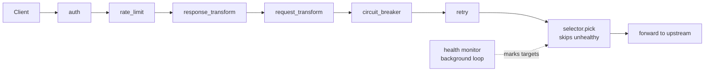
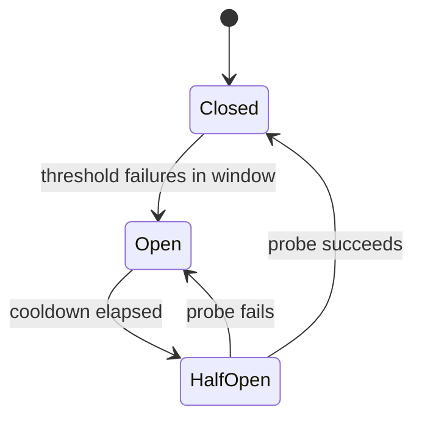

# GatewayKit Technical Implementation Plan

Sep 23, 2026 · @Matt

## Summary

The foundation and API-key auth are done; this plan builds the six remaining config features in priority order: rate limiting, retry, circuit breaker, load balancing, health checks, then transforms. Each lands as one `Feature` module plus tests, so every step leaves a working, committable gateway.

The requirement is a config-driven API gateway (GatewayKit) that reads `gateway.yaml` and must work with any config using the same schema. It is a 2-hour take-home that is deliberately too big to finish. The graders weight architectural judgment 35%, code quality 25%, production thinking 25% and communication 15%.

Non-negotiables (all already met):

- Listen on `gateway.port`, config path from argv or env var
- `GET /health` returns 200 `{ "status": "healthy", "uptime_seconds": <int> }`
- Proxy matched routes, 404 on no match, 405 on disallowed method
- Work with a different config of the same schema

Deliverables: git history that tells a story, `DECISIONS.md`, a one-command self-contained test suite with a mock upstream, and a `README.md` with a feature checklist. No existing proxy or gateway libraries are allowed.

## Current state

Every config field is already parsed, validated and normalized into `src/config/types.ts`; what is missing is runtime behavior for six features. The extension point is in place: `Feature.create(route, deps)` returns a middleware or `undefined`, and `src/features/index.ts` registers them outermost first.

| Config feature | Status | Where it lives / will live |
| --- | --- | --- |
| `port`, `global_timeout`, `/health`, routing, 404/405, `strip_prefix` | Done | `src/server.ts`, `src/router.ts` |
| Proxying, per-route timeout (504), connection failure (502), client abort (499) | Done | `src/proxy/transport.ts` |
| Config validation (all errors at once) | Done | `src/config/validate.ts` |
| `auth` (`api_key`) + failed-attempt limiter | Done | `src/features/auth.ts` |
| `rate_limit` / `global_rate_limit` | Parsed only | new `src/features/rate-limit.ts` |
| `retry` | Parsed only | new `src/features/retry.ts` |
| `circuit_breaker` | Parsed only | new `src/features/circuit-breaker.ts` |
| `upstream.targets` + `balance` | Parsed; always first target | `src/upstream/selector.ts` |
| `health_check` | Parsed only | new `src/upstream/health.ts` |
| `request_transform` / `response_transform` | Parsed only | new `src/features/transform/*.ts` |

Useful building blocks already exist: an injected `Clock` for time-based tests, `GatewayError` for gateway-generated responses, `GatewayDeps.shutdown` for stopping background work, and a mock upstream with `/slow`, `/status/NNN`, `/flaky` and `/healthz` endpoints.

## Proposed design

Keep the existing architecture: each feature is one middleware module, and load balancing plus health checks live below the pipeline in `src/upstream/`, because they choose a target per attempt rather than wrap a request.

Each arrow is one `next()` call. Transforms sit outside the breaker so a retried request is transformed once, and response headers apply to every upstream reply.

### Rate limiting (`src/features/rate-limit.ts`)

- A `RateLimiter` interface with `take(key) → { allowed, remaining, resetMs }` and two implementations, chosen by `strategy`.
- **fixed\_window**: `Map<key, { start, count }>`, same shape as the auth failure counter.
- **sliding\_window**: a sliding log of accepted timestamps per key. It is exact, and memory is bounded because a key never stores more than `requests` entries.
- Key = `req.clientIp` for `per: ip`, a constant for `per: global`. Buckets are per route, so the global default gives each route its own 100/60s budget.
- Concurrency: check-and-increment is synchronous, so on Node's single thread 50 simultaneous requests get exactly `requests` passes, no race.
- Rejection: 429 `too_many_requests` with `Retry-After`; successful responses carry `X-RateLimit-Limit` and `X-RateLimit-Remaining`.
- Expired keys are swept once per window, so per-IP maps cannot grow without bound.

### Retry (`src/features/retry.ts`)

- `attempts` = total attempts, including the first (3 → 1 call + 2 retries).
- Retry when the upstream response status is in `on`, or when `forward` throws a 502 or 504 whose status is in `on`. Never retry a 499 or a gateway rejection.
- Every method the route allows is retried, POST included, because the config asks for it; the duplicate-write risk goes in `DECISIONS.md`.
- Delay before retry n: `fixed` = `initial_delay`; `exponential` = `initial_delay × 2^(n−1)` with ±20% jitter so clients do not retry in lockstep.
- Backoff sleeps stop on `req.signal`, which needs `Clock.sleep(ms, signal?)`.
- The last attempt's outcome is returned as-is, so the client sees the real upstream status.
- Each attempt calls `selector.pick()` again, so a retry can land on a different target.

### Circuit breaker (`src/features/circuit-breaker.ts`)

- A failure is a thrown 502/504 or an upstream status ≥ 500, measured after retries. 4xx and 499 are not failures.
- Closed: keep failure timestamps inside `window`; trip when the count reaches `threshold`.
- Open: throw 503 `{ "error": "service_unavailable", "retry_after": <seconds_remaining> }` plus a `Retry-After` header, without calling the upstream.
- Half-open: one probe request passes; concurrent requests are still rejected until it resolves.

### Load balancing (`src/upstream/selector.ts`)

- `round_robin`: a counter modulo the healthy targets.
- `weighted_round_robin`: nginx's smooth weighted round robin, so weights 3:1 give A A B A rather than A A A B bursts.
- Unhealthy targets are skipped. If every target is unhealthy, fail open and use all of them, with a warning log, rather than guarantee a 503.

### Health checks (`src/upstream/health.ts`)

- A `HealthMonitor` per route with `health_check`, started from `buildRouteHandler` and stopped by `deps.shutdown`.
- Each interval, `GET target + path` with a timeout of min(interval, route timeout). Non-2xx or an error counts as a failure.
- `unhealthy_threshold` consecutive failures mark the target unhealthy. There is no `healthy_threshold`, so one success marks it healthy again.
- The loop uses `clock.sleep`, so tests drive it with a fake clock.

### Transforms (`src/features/transform/`)

- `values.ts` resolves dynamic values in one place: `$request_time` and `$response_time` (ISO 8601 UTC), `$route_path` (the route's configured path), `$body`, and `$literal:<text>`. An unknown `$name` is a config validation error at startup.
- **Headers**: remove first, then add, on the request before forwarding and on the response before returning.
- **Request body mapping**: only for JSON bodies. Build a new object from `destination ← source` dot paths; unmapped fields are dropped and missing sources are omitted. A non-JSON or empty body passes through unchanged; invalid JSON with a JSON content type gets 400.
- **Response envelope**: parse the upstream body as JSON (fall back to the raw string), substitute into the envelope template, and set `content-type: application/json`. Send `accept-encoding: identity` upstream on these routes so compressed bodies do not break parsing.
- Gateway errors are thrown, so they bypass the envelope; only real upstream replies are wrapped.

## Implementation phases

Build in this order, one commit (or small set of commits) per phase, updating the README checklist and `DECISIONS.md` as each lands. Order follows the grading: rate limiting and resilience score on production thinking; transforms carry the most ambiguity for the least value.

| # | Phase | Files | Done when |
| --- | --- | --- | --- |
| 1 | Rate limiting | `features/rate-limit.ts`, `features/index.ts` | 50 concurrent requests to a 10/10s route give exactly 10 × 2xx and 40 × 429; sliding window verified at a boundary with a fake clock |
| 2 | Retry | `features/retry.ts`, `clock.ts` (abortable sleep) | `/flaky?fail=2` succeeds on attempt 3; backoff delays match 1s, 2s; client abort stops further attempts |
| 3 | Circuit breaker | `features/circuit-breaker.ts` | 5 failures open it; next request gets 503 with `retry_after`; after cooldown one probe closes it |
| 4 | Load balancing | `upstream/selector.ts` | 400 requests at weights 3:1 split 300/100, interleaved; round robin alternates |
| 5 | Health checks | `upstream/health.ts`, `pipeline/build.ts` | 3 failed probes remove a target; one success restores it; loop stops on shutdown |
| 6 | Header transforms | `features/transform/headers.ts`, `transform/values.ts` | Legacy route adds `X-Gateway`, strips `X-Debug` upstream and `Server` downstream |
| 7 | Body transforms | `features/transform/body.ts`, `config/validate.ts` | Mapping and envelope match the example config; non-JSON bodies pass through |
| 8 | Docs pass | `README.md`, `DECISIONS.md` | Checklist accurate; "what I'd build next" and AI-usage sections filled |

If time runs short, stop after phase 5 and skip straight to phase 8: five clean features plus clear notes beat seven half-done ones. Phases 1–3 are independent of 4–5, so they can also be split across two parallel worktrees.

## Testing and verification

Every phase ships with tests in the existing vitest suite, and `npm test` stays the single self-contained command.

- **Unit tests with a fake clock** for the limiters, breaker state machine, backoff schedule, weighted selection and health state. No real sleeping.
- **Integration tests through `startGateway`** against in-process mock upstreams on ephemeral ports, one file per feature (`rate-limit.test.ts`, `retry.test.ts`, and so on).
- **Concurrency test**: fire 50 requests with `Promise.all` at a limited route and count 2xx vs 429.
- **Failure-mode tests**: upstream down (dead port), slow (`/slow`), flaky (`/flaky`), client abort mid-retry, all targets unhealthy.
- **Second-config test**: a fixture YAML with different paths, ports and limits, to guard against anything hard-coded to the example config.
- **Mock upstream additions**: a counter endpoint to verify which target served a request, and a switch to make `/healthz` fail on demand.
- Run `npm run typecheck` alongside tests before each commit.

## Risks and open questions

The biggest risk is time: seven phases are unlikely to fit in the 2-hour budget, so the phase-5 cut line matters more than any single design choice.

**Risks**

- Retry plus timeouts can far exceed the route timeout: 3 attempts × 5s + 1s + 2s backoff = 18s. Mitigation: document it; a total-deadline budget is a "next" item.
- In-memory state is per process: rate limits and breakers do not coordinate across instances. Acceptable per the brief; note it in `DECISIONS.md`.
- Buffered bodies already cap at 10 MB; envelope parsing adds a second copy in memory per request on transform routes.

**Open questions (make a call and document it)**

- [x] Retry non-idempotent methods? The example config retries a route that allows POST. Decided: honor the config and retry every method the route allows, POST included. Duplicate-write risk is documented in DECISIONS.md; idempotency keys are a "next" item.
- [x] All targets unhealthy: fail open (proposed) or return 503? Decided: fail open. The selector picks among all targets as if healthy and logs a warning once on entering that state; see DECISIONS.md.
- [ ] Should the circuit breaker count 5xx responses, or only transport failures (502/504 thrown)? Proposed: both.
- [ ] `$request_time` format: ISO 8601 (proposed) or Unix milliseconds?
